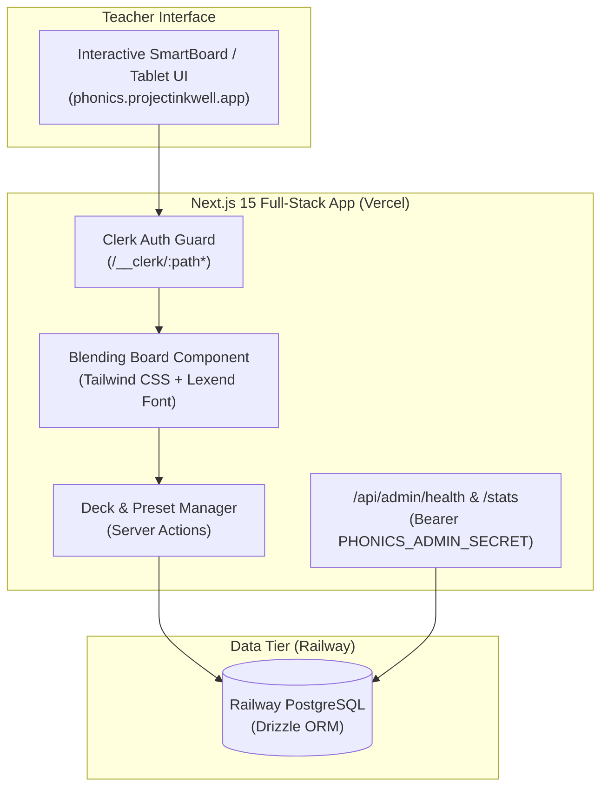

# AGENTS.md — Autonomous Agent Operating Manual (Inkwell Phonics)

> **Project Inkwell: Phonics Blending Board**  
> **Domain:** [phonics.projectinkwell.app](https://phonics.projectinkwell.app)  
> **Target Audience:** Primary Grade Teachers (2nd Grade) & Reading Specialists  
> **Linear Label:** `app:phonics`  

Welcome, Agent. This repository contains the source code, curriculum presets, and presentation interfaces for **Inkwell Phonics**, the teacher-centric digital blending board in the Project Inkwell fleet.

When developing, refactoring, or generating code in this repository, you **must** adhere strictly to the architectural constraints, privacy boundaries, and DevOps worktree protocols detailed below.

---

## 1. System Architecture & Tech Stack



### Key Technical Tenets
1. **Next.js 15 App Router + React 19:** Server Components for initial deck loads and SEO; Client Components for responsive tactile card flipping, column locking, and sound blending.
2. **PostgreSQL & Drizzle ORM:** Clean, typed migrations with Railway Postgres.
3. **Clerk Authentication:** `@clerk/nextjs` with Google SSO and custom domain configuration (`clerk.phonics.projectinkwell.app`).
4. **Primary-Grade Accessibility:** Typography uses Google Font **Lexend** (true single-story 'a' and 'g'). Large touch targets suitable for interactive whiteboards (SmartBoard/Promethean).

---

## 2. Non-Negotiable Invariants

### Invariant 1: Local Git Identity Safety
- **Every commit must be authored by:**  
  `Bryan Wise <bryan.wise@gmail.com>`  
- Commits authored by machine hostname fallbacks (e.g. `bwise@bmini.local`) trigger Vercel Team Seat Protection `BLOCKED` states (`TEAM_ACCESS_REQUIRED`), deadlocking CLI builds.
- Always verify with `git config user.email` prior to committing.

### Invariant 2: Teacher Content Privacy
- In line with Project Inkwell Fleet standards, the Admin Portal (`admin.projectinkwell.app`) may only inspect aggregate metrics (e.g., total active teachers, total decks created, total card flips).
- **Never** expose or inspect individual teachers' custom word lists or student identifiers.

### Invariant 3: Zero-Crash Resiliency
- The board interface must remain interactive even if offline or disconnected; default curriculum presets must be bundled in client-accessible fallback memory.

---

## 3. DevOps Protocol: Git Worktrees for Isolated Development

Human developers and autonomous coding agents routinely work across multiple Project Inkwell repositories simultaneously.

### 3.1. The Isolation Invariant
> **CRITICAL RULE**: Never make changes or switch branches in the primary working tree (`/Users/bwise/projects/phonics`) during concurrent agent tasks. Doing so risks corrupting active development sessions, dirtying working trees, and colliding with human edits.

### 3.2. Worktree Execution Procedure
```bash
# 1. Create a dedicated worktree in the git-ignored .worktrees/ directory
cd /Users/bwise/projects/phonics
git worktree add .worktrees/PRO-XX-feature-name -b feat/PRO-XX-feature-name main

# 2. Develop and test inside the worktree
cd /Users/bwise/projects/phonics/.worktrees/PRO-XX-feature-name

# Copy local environment files if needed
cp ../../.env.local .env.local

# Run tests and verify build
npm run build

# Commit changes
git add .
git commit -m "feat(phonics): implement feature closes PRO-XX"

# 3. Clean up
cd /Users/bwise/projects/phonics
git worktree remove .worktrees/PRO-XX-feature-name
git worktree prune
```

---

## 4. Linear Issue Tracking & Autonomous Agent Execution Protocol

Project Inkwell uses **Linear** as its central engineering backlog and single source of truth for task execution.

- **Workspace Team:** `Projectinkwell` (Key Prefix: `PRO-`)
- **App Domain Label:** `app:phonics`
- **Workflow States:** `Backlog` ➔ `Todo` ➔ `In Progress` ➔ `Done`
- **Linear CLI:** `node /Users/bwise/projects/admin/scripts/linear.mjs [list|quota|create|update|view]`

### Linear Modeling Rules (Free Tier Quota Protection)
- App domains are tracked via labels (`app:phonics`), **never** indefinite project containers.
- Projects are reserved for time-bound release milestones.
- When an issue is moved to `Done`, it is automatically unlinked from the project to enable scheduled auto-archiving.
