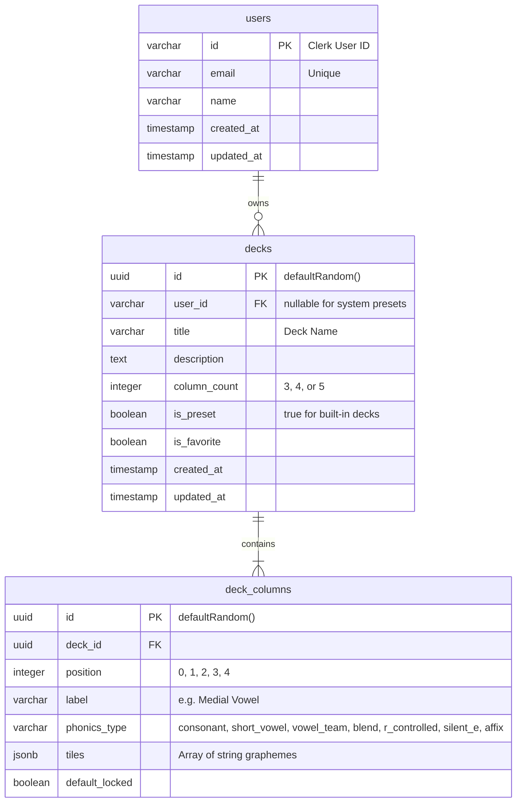

# System Design: Inkwell Phonics Blending Board

**Date:** 2026-09-29  
**Domain:** `phonics.projectinkwell.app`  
**Target Audience:** Primary Grade Teachers (2nd Grade) & Elementary Reading Specialists  
**Framework:** Project Inkwell Fleet  

---

## 1. Problem Statement & Classroom Need

Second-grade reading instruction requires daily phonemic awareness, word chaining, and decoding practice aligned with systematic phonics scope and sequences (such as HD Word, UFLI, and Orton-Gillingham). 

Existing digital blending boards present several key frustrations for teachers:
1. Rigid card/column structures that do not support 4-column (Silent-E, Consonant-le) or 5-column (Complex CCVCe, Syllable Chaining) words.
2. Inability to save custom board configurations or deck presets matching weekly curriculum units.
3. Lack of quick column locking (e.g. keeping medial vowels or final codas static to isolate onset substitutions).
4. No clear visual indicator to differentiate real English words from pseudowords (nonsense words) during rapid-fire blending drills.
5. Inconvenient classroom presentation sizing, poor touch ergonomics for interactive displays (SmartBoard/Promethean), and non-pedagogical fonts that confuse young readers with double-story "a" and "g".

**Inkwell Phonics** solves these problems with an interactive, teacher-configurable blending board application integrated into the Project Inkwell ecosystem.

---

## 2. Core User Experience & Feature Set

### 2.1. Interactive Blending Board
- **Dynamic 3, 4, and 5-Column Decks:** Seamlessly transitions between CVC, Silent-E, R-controlled vowels, and multisyllabic syllable chaining.
- **Card-Flipping Mechanics:**
  - Tap/click any individual column to advance to its next tile.
  - Upward swipe or secondary arrow to retreat to previous tile.
  - Prominent **"Next Word"** button that rolls all unlocked columns simultaneously.
  - **Lock Toggle:** Per-column padlock control to freeze specific graphemes during word-family drills.
  - **Shuffle / Sequential Modes:** Toggle between curriculum order and random rotation.
- **Real vs. Nonsense Word Indicator:**
  - An optional, non-distracting badge displays whether the current combination forms a valid English word or a pseudoword.
  - Supports intentional nonsense-word decoding drills (essential in 2nd grade) while giving the teacher immediate certainty.
- **Classroom-First Typography & Color Standards:**
  - Font: **Lexend** (clean primary-grade shapes, single-story `a` and `g`).
  - Phonics Role Color Coding:
    - Consonants: Blue / Slate
    - Short Vowels: Red / Coral
    - Vowel Teams & R-Controlled: Amber / Green
    - Affixes, Welded Sounds, & Silent-E: Violet / Teal
  - High-contrast card display with responsive sizing for interactive boards and tablets.

### 2.2. Deck Library & Teacher Customization
- **Pre-Configured System Decks (Seeded from Curriculum Scope):**
  - **3-Column:** CVC Deck, Digraph & Trigraph Deck, Blends Deck (CCVC / CVCC), Vowel Team Deck.
  - **4-Column:** Silent-E (VCe) Deck (locked `e` in Col 4), Complex Initial Blend + Vowel + Final Blend, R-Controlled Vowels Deck, Consonant-le (_le) Endings.
  - **5-Column:** Complex CCVCe Deck, Syllable Chaining Compound Words, Advanced Vowel Team + Suffixes, Vowel-R Multisyllabic Base Deck.
- **Custom Configuration Storage:**
  - One-click duplicate and edit system presets.
  - Create custom decks with arbitrary tile lists, column labels, and default locks.
  - Store and manage saved decks under the teacher's authenticated Clerk profile.

---

## 3. Architecture & Data Model

### 3.1. Technical Stack
- **Framework:** Next.js 15 (App Router) + React 19 + Tailwind CSS + Lucide Icons.
- **Authentication:** Clerk (`@clerk/nextjs`) with Google SSO, email/password, and custom domain (`clerk.phonics.projectinkwell.app`).
- **Database & ORM:** PostgreSQL on Railway using Drizzle ORM (`drizzle-kit`, `postgres` client).
- **Deployment:** Frontend on Vercel (`phonics.projectinkwell.app`), Database on Railway.
- **Admin Fleet Integration:** `/api/admin/health` and `/api/admin/stats` endpoints protected by `PHONICS_ADMIN_SECRET`.

### 3.2. Relational Schema (PostgreSQL / Drizzle)

---

## 4. Inkwell Fleet & DevOps Protocols

### 4.1. Linear Backlog Management
- **Workspace:** `Projectinkwell` (`PRO-`).
- **Domain Label:** `app:phonics`.
- **Milestone Project:** Scoped release milestone (auto-unlinking on `Done` to preserve free-tier 250 issue limit).

### 4.2. Local Git Identity Invariant
- **Author Name:** `Bryan Wise`
- **Author Email:** `bryan.wise@gmail.com`
- Prevents Vercel Team Seat Protection `BLOCKED` states (`TEAM_ACCESS_REQUIRED`).

### 4.3. Worktree Protocol
- All agent feature branches must use isolated `.worktrees/PRO-XX-...` paths to protect the primary working tree.
