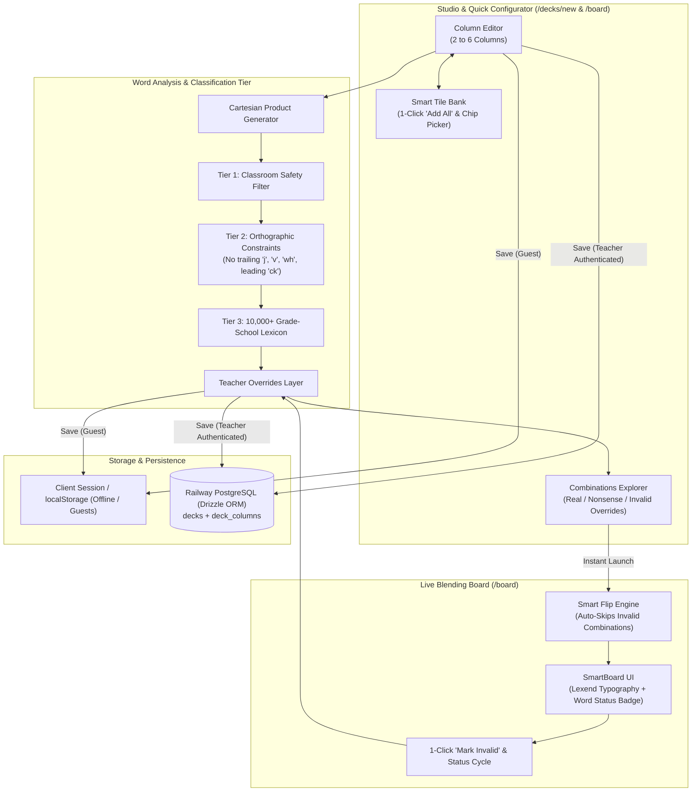

# Board Configurator & Word Combination Matrix Design

**Domain:** [phonics.projectinkwell.app](https://phonics.projectinkwell.app)  
**Date:** 2026-10-04  
**Audience:** Primary Grade Teachers (2nd Grade) & Reading Specialists  
**Linear Domain:** `app:phonics`  

---

## 1. Executive Summary

Inkwell Phonics provides a digital blending board for early reading instruction. This feature introduces a **Board Configurator** and **Phonotactic Word Matrix Engine** enabling teachers to:
1. Dynamically configure 2 to 6 blending columns with specialized phonics roles (`consonant`, `short_vowel`, `vowel_team`, `r_controlled`, `silent_e`, `affix`, `blend`).
2. Rapidly populate columns from a categorized **Smart Tile Bank** (Single Consonants, Digraphs, Blends, Vowel Teams, R-Controlled, Affixes, or full Curriculum Presets).
3. Automatically analyze all Cartesian combinations of a deck with a **3-Tier Word Analysis Engine** (Classroom Inappropriate Filter, English Orthographic Rules, and Expanded 10,000+ Word Lexicon).
4. Review, search, and override word classifications (`Real`, `Nonsense`, or `Invalid / Excluded`) directly inside the configurator.
5. Prevent invalid or inappropriate combinations from appearing during classroom instruction on the live SmartBoard interface, with 1-click "Mark Invalid / Never Show" controls.

---

## 2. Architecture & Data Flow



---

## 3. Data Model Extensions

### 3.1. Word Classification Types

```typescript
export type WordClassification = 'real' | 'nonsense' | 'invalid';

export interface WordOverrideMap {
  [word: string]: WordClassification;
}

export interface DeckConfig {
  id?: string;
  title: string;
  subtitle?: string;
  description?: string;
  columnCount: number;
  columns: ColumnConfig[];
  wordOverrides?: WordOverrideMap; // Teacher manual adjustments
}
```

### 3.2. Database Schema Alignment (`src/db/schema.ts`)
The `decks` table incorporates a JSON column `wordOverrides` (default `{}`) storing teacher adjustments for Real, Nonsense, or Invalid exclusions.

---

## 4. Word Analysis Engine (Three Tiers)

1. **Tier 1: Classroom Safety & Profanity Shield**
   - High-confidence blocklist of inappropriate words, slurs, profanity, and offensive slang.
   - Any match is automatically tagged `invalid` and excluded from classroom presentation.

2. **Tier 2: English Orthographic / Phonotactic Rules**
   - True English words do not end in `j` (they use `-dge`), `v` (they use `-ve`), or `wh`.
   - Digraph `ck` only occurs in final codas following a short vowel, never in word-initial onsets.
   - Combinations violating standard English spelling phonotactics are auto-flagged `invalid`.

3. **Tier 3: Expanded Grade-School Lexicon (10,000+ Words)**
   - Expands the lexicon beyond the initial sample list to include common 2nd, 3rd, and 4th-grade decodable vocabulary.
   - Words found in the lexicon are classified as `real`.
   - Words absent from the lexicon that pass Tiers 1 and 2 are classified as decodable `nonsense`.

4. **Tier 4: Teacher Overrides**
   - Teachers can toggle any word to `real`, `nonsense`, or `invalid` (hidden). Teacher overrides take highest precedence.

---

## 5. User Interface & Interactions

### 5.1. Studio Configurator (`/decks/new` and `/decks/[id]/edit`)
- **Column Header:** Add/Remove columns (bounded 2–6), reorder left/right, and select phonics role.
- **Smart Tile Bank:** Slide-over or inline tray categorized by:
  - *Consonants* (Initial Singletons & Final Singletons)
  - *Short Vowels* (`a, e, i, o, u`)
  - *Digraphs & Trigraphs* (`sh, ch, th, wh, ph, ck, tch, dge, ng, nk`)
  - *Initial Blends* (L-blends, R-blends, S-blends)
  - *Final Blends* (`st, nd, nt, mp, lt, lk, sk, pt, ft`)
  - *Vowel Teams & Diphthongs* (`ai, ay, ee, ea, oa, oi, oy, ou, ow, oo, ue, ew, au, aw`)
  - *R-Controlled Vowels* (`ar, er, ir, or, ur`)
  - *Affixes & Silent-e* (`_e, -s, -es, -ed, -ing, -er, -est, -ly`)
  - *Custom text entry*
- **Combinations Explorer Tab:**
  - Metric summary: Total words, count of Real, Nonsense, and Invalid (Excluded).
  - Search filter by text substring or phoneme.
  - Interactive 3-way toggle per word: `[Real] [Nonsense] [Hide / Exclude]`.

### 5.2. Live Board Player (`/board`)
- **Auto-Skip Invalid Combinations:** Random shuffle and sequential flips automatically cycle past any combination tagged `invalid`.
- **1-Click Mark Invalid Button:** An eye-slash / exclude button next to the Word Status Badge allows teachers to instantly ban the currently displayed word with 1 click. The board immediately rolls to the next approved word.
- **Interactive Word Status Badge:** Clicking the `Real Word` or `Nonsense Word` badge directly cycles its status, enabling immediate correction if an obscure real word is detected as nonsense.
- **Dimmed State on Manual Dial:** If a single column is manually flipped into an invalid combination, the status badge dims with a message and a 1-click `[Skip to Next Valid Word]` button.

---

## 6. Invariants & Fleet Standards

- **Invariant 1 (Git Identity):** Authored strictly by `Bryan Wise <bryan.wise@gmail.com>`.
- **Invariant 2 (Teacher Privacy):** Custom decks and word lists belong to teachers; admin portal metrics remain aggregate.
- **Invariant 3 (Zero-Crash Resiliency):** The expanded lexicon, phonotactic rules, and tile libraries are bundled client-side so the configurator and blending board operate seamlessly offline.
- **Primary Accessibility:** Google Font **Lexend** with strict single-story `a` and `g`, large 44px+ touch targets for SmartBoards.
